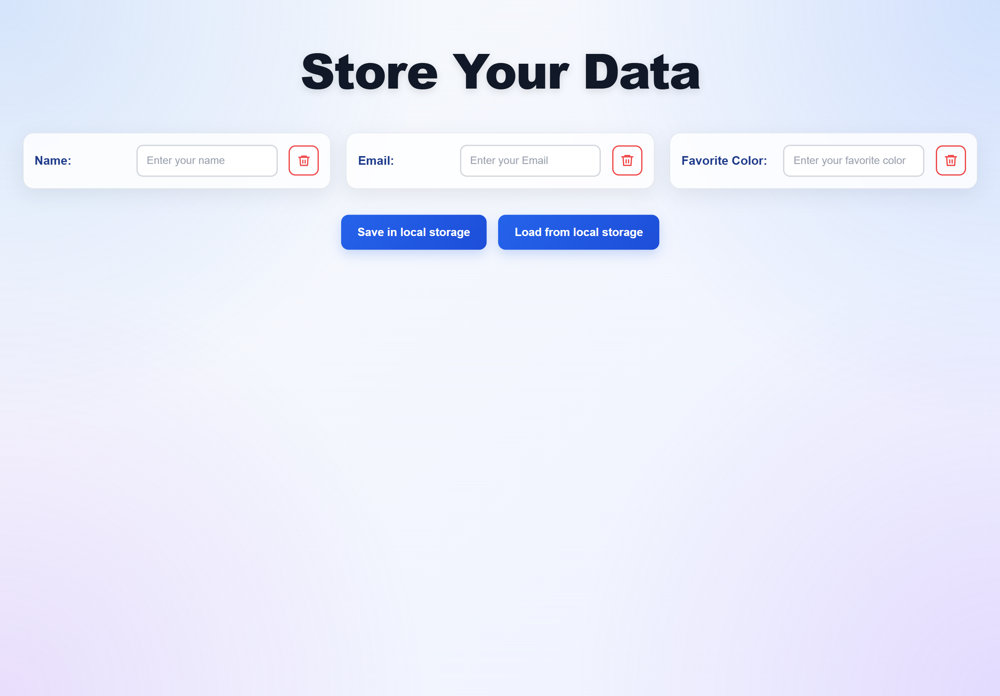

# Local-Storage-Frontend-Practice

A simple, responsive frontend web application built to practice interacting with the browser's Local Storage API. This project allows users to save, load, and manage data efficiently using standard web technologies.

## ✨ Features

- **Save Data:** Securely store user inputs (Name, Email, Favorite Color) in the browser's Local Storage.
- **Load Data:** Retrieve and populate input fields with previously saved data on demand.
- **Targeted Deletion:** Delete specific data entries individually using dedicated delete buttons.
- **Modern UI/UX:** Clean, responsive interface featuring CSS Grid, glassmorphism-style inputs, and smooth hover transitions.
- **User Feedback:** Real-time alert notifications upon successful save, load, or delete actions.

## 🛠️ Technologies Used

- **HTML5:** Semantic structuring of the user interface.
- **CSS3:** Flexbox, CSS Grid, custom radial/linear gradients, responsive media queries, and UI animations.
- **Vanilla JavaScript (ES6+):** DOM manipulation, event listeners, and `localStorage` API integration.

## 🚀 Getting Started

1.  Clone this repository or download the source code.
2.  Open the `index.html` file in your preferred web browser.
3.  Enter data into the fields and click **Save in local storage**.
4.  Clear the fields or refresh the page, then click **Load from local storage** to retrieve your data.
5.  Use the red trash bin icons next to each input field to delete that specific item from the local storage.

## 👨‍💻 Author

**Mohamed Ragheb Omar**
